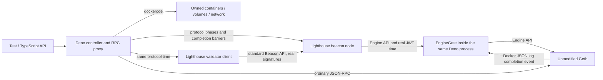

# Architecture and verification boundaries

The execution client is unmodified Geth v1.15.11 (`36b2371c59cd91a9b1da062b3e382f05a6d8687e`).
Lighthouse v7.1.0 is pinned at `cfb1f7331064b758c6786e4e1dc15507af5ff5d1`; genesis-generator v4.0.0
is pinned at `f06b98c2cb789c6ac45fd0e6167173820dc095d2`. Image digests are in `src/config.ts`. The
target is Prague/Electra, without later forks. Deno 2.9.7 passed the dockerode 4.0.7
socket/logs/exec/events lifecycle smoke test. Earlier attempted Deno 2.2.12 and 2.5.6 exposed Unix
HTTP stream failures, so they are not supported.

The baseline uses the official Lighthouse image. The controlled profile refuses to start without the
locally built fork. It never falls back to ordinary clocks.

The controller serializes time mutations. Each slot has phase boundaries at 0, 4, 6, 8, 9 and 11.5
seconds: proposal, attestations/sync messages, selection-proof preparation, aggregates, state
advance and fork-choice preparation. Advancing the BN first prevents the VC from proposing into a
future slot of the BN. A control clock acknowledgement only establishes the clock value; completion
watermarks and EL/CL head agreement establish completion of the protocol work.

`ManualSlotClock` only supplies time calculations and does not drive async tasks.
`BeaconChainHarness` explicitly drives block/attestation processing in tests, including optional
mocked execution. It is a useful reference, but is not used as the runtime client. The fork keeps
production clients and HTTP validation paths.

`clients/controlled_clock.rs` adds an opt-in process-local watch clock. Tokio watch notifications
wake protocol sleeps without polling while paused. Only the reviewed schedulers import the new sleep
functions. Ordinary Tokio timers, network request deadlines, JWT generation, networking and
watchdogs keep real time.

The maintained patch changes:

- `common/slot_clock`: clock source and watch-based protocol sleeps.
- `beacon_node/timer`: per-slot work.
- `beacon_chain/{state_advance_timer,proposer_prep_service}`: state/fork-choice preparation.
- `validator_services/{duties,preparation,attestation,sync_committee}_service`: duty schedules and
  successful-work watermarks.
- `validator_client/src/lib.rs`: genesis wait and startup watermark.
- `beacon_node_fallback`: slot-based status schedule; request deadlines remain real.

Network gossip subscriptions, real-time metrics/notifiers, and optional services are not converted
globally. P2P is disabled in this single-node topology. Extending to multi-node/fork-transition
testing needs a separate scheduler audit. Current barriers assume that all genesis validators are
held by the single VC.

Geth's PoS header verification deliberately does not compare a block timestamp with the host clock;
it still requires a strictly increasing timestamp. Engine API payload attributes supply that
timestamp. Payload-building deadlines and txpool expiry continue to use real time. Source evidence:
[Beacon header validation](https://github.com/ethereum/go-ethereum/blob/v1.15.11/consensus/beacon/consensus.go),
[Engine API](https://github.com/ethereum/go-ethereum/blob/v1.15.11/eth/catalyst/api.go),
[payload preparation](https://github.com/ethereum/go-ethereum/blob/v1.15.11/miner/worker.go).
Runtime acceptance beyond host time, finality and lifecycle are exercised by the real e2e scripts.

`src/engine.ts` is a version-specific Engine API adapter inside the same controller process. Geth
v1.15.11 starts payload jobs with an empty payload, builds the full payload asynchronously, and uses
a real 12-second building deadline. `getPayloadV4` can return the empty version immediately. The
adapter forwards fork-choice updates but removes payload attributes for a future protocol slot, so a
pause cannot consume its build window. For the current slot, it waits for the Geth JSON
`Updated payload` event before forwarding `getPayload`. That log follows installation of the full
payload under its lock. It does not alter a payload, signatures, withdrawals, requests or finality.
Source:
[payload builder](https://github.com/ethereum/go-ethereum/blob/v1.15.11/miner/payload_building.go).
The log stream uses dockerode; waits are bounded and readiness IDs are capped at 128. This
dependency must be rechecked before changing the Geth version.

Docker containers reach this adapter through `host.docker.internal`; it therefore listens on a host
wildcard address. It verifies the shared JWT signature and **real-time** issue time before
processing any call, and Geth verifies the JWT again. Public RPC, Beacon API and clock/VC ports are
bound to localhost. The JWT-protected Engine listener is the sole wildcard-listener exception.

Automine forwards the upstream RPC response unchanged and schedules bounded work. It checks the next
sender nonce, balance, next block base fee and gas limit; nonce gaps alone never advance time. A
candidate set that survives a produced block unchanged stops the loop. Manual advancement can
re-evaluate pending work. Direct calls to the private EL endpoint bypass automine; tests should use
the controller's advertised RPC endpoint.

For an upstream update: pin new commits and images, inspect every patch hunk and protocol sleep call
site, regenerate the patch with `scripts/patch_lighthouse.py` against a clean pinned checkout, run
the Rust clock test, ordinary baseline and all real e2e checks. Preserve original signature/state
checks. Build cost is independent of ordinary devnet startup.

Forward travel and explicit skipped slots are different operations. `advanceTime`/`advanceTo`
execute every intervening proposal, vote and state transition. `skipSlots` finishes the current
slot, stops the VC, advances BN time and restarts the VC with the same keys and slashing protection
at the new time. The next block performs real empty-slot transitions, penalties and committee
changes. Private VC port numbers may change; its manifest is updated. No fake votes fill the gap.

The default mainnet churn quotient is 65536. With 64 validators, Electra has no consolidation churn
capacity: its activation/exit allocation consumes the available churn. `examples/protocol.ts`
explicitly sets `churnLimitQuotient: 4` (512 ETH total balance churn, 256 ETH consolidation capacity
before balance changes) to test consolidation without thousands of keys. All ordinary timing delays,
including 256-epoch exit eligibility and withdrawal delay, remain intact. See
[Electra churn rules](https://github.com/ethereum/consensus-specs/blob/v1.5.0/specs/electra/beacon-chain.md).

The exit fixture observes a real EL withdrawal. A validator may still belong to the current sync
committee after exit and receive small subsequent rewards. In pinned Lighthouse, the API status
`withdrawal_done` uses effective balance, updated at an epoch transition. The fixture additionally
waits through the committee rotation and final sweep, checking zero actual balance and final status.
