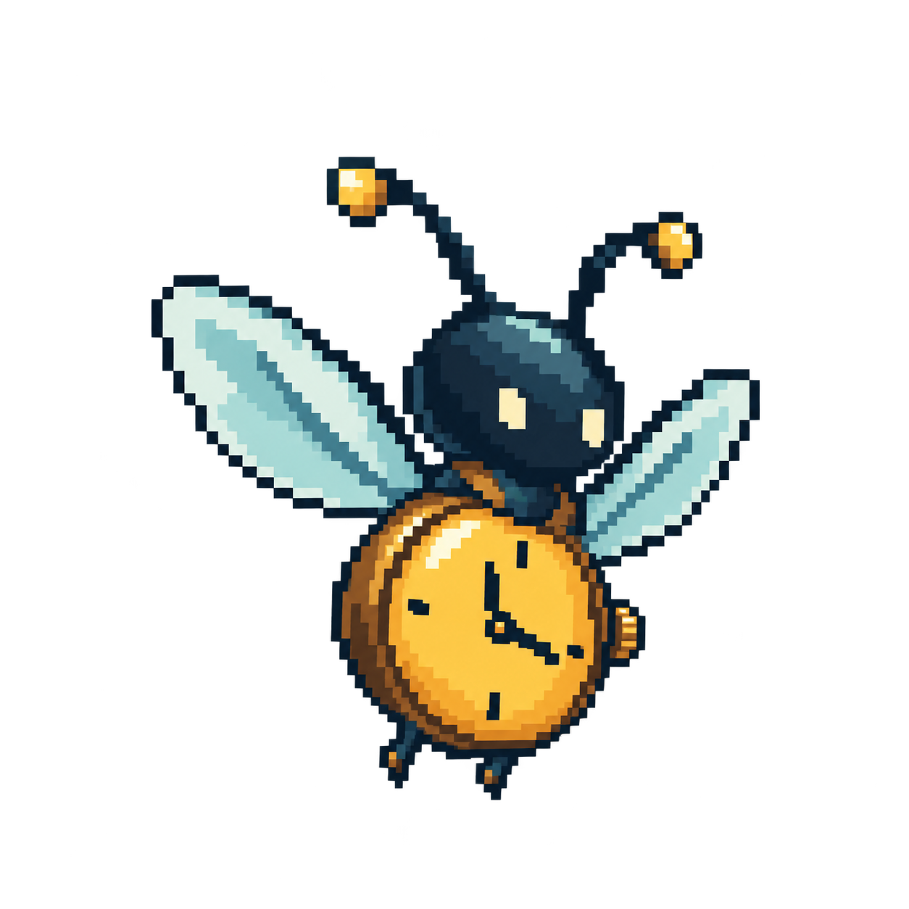
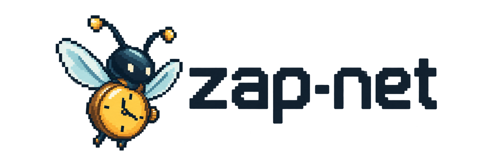

# Mascot and artwork

The zap-net mascot is a pixel-art firefly with a clock abdomen. Its light evokes "zap" and
Lighthouse; the clock represents explicit control of protocol time. The small winding crown
emphasizes that time advances on command. Its simple silhouette reflects the project: one
controller, a local network and a small API.

  

## Files

| File                            | Purpose                                                                     |
| ------------------------------- | --------------------------------------------------------------------------- |
| [mascot.png](assets/mascot.png) | Standalone mascot with a transparent background                             |
| [logo.png](assets/logo.png)     | Mascot and pixel wordmark with a transparent background; for light surfaces |
| [banner.png](assets/banner.png) | README banner with a dark background and light wordmark                     |

## Style

The visual reference is a 64×64 sprite from a 16-bit adventure game: a three-quarter view, a thin
outline, restrained pixel shading and directional light. Narrow wings and a compact head keep the
clock as the focal point. The silhouette, limited detail and open space preserve the minimal style.

Palette: midnight blue `#142333`, blue teal `#284553`, cyan `#86BFC3`, pale cyan `#C1E1DB`, bronze
`#86603D`, amber `#D4973E`, yellow `#F2C65B` and ivory `#F6E8BE`. These are palette references; the
PNGs contain additional shades.

The files are large raster masters for the README and previews. 64×64 describes the intended sprite
style, not the physical dimensions of these PNGs.

Preserve the aspect ratio. Use nearest-neighbor resampling when resizing in an editor. On dark
surfaces, place the logo on a light background or use the ready-made banner. Keep costumes, tools
and small decorative details out of the mascot; the clock already communicates the idea.

The artwork was created with the built-in ImageGen tool. Exact prompts are saved in
[prompts.md](assets/prompts.md). The assets are raster PNGs; vector sources are not included.
