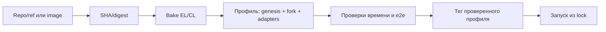

# Несколько версий EL/CL и Gloas в zap-net

Исследование от 29 сентября 2026 года; zap-net `9078f84`. Проверены локальный код и публичные
исходники по конкретным SHA. Новые клиенты не собирались, сеть Gloas не запускалась. Снимок версий и
результат проверки патча сохранены в [отчёте](../reports/client-version-research.json).

**Рекомендация:** добавить каталог отдельных сборок EL/CL и именованные профили совместимых
комплектов. Профиль фиксирует EL, BN/VC, genesis-generator, протокольное расписание, адаптеры и
результаты проверок. Пользователь собирает комплект один раз и запускает его по тегу. Перемотка
времени остаётся обязательным критерием готовности каждого controlled-профиля.

Первый объём — разные версии, ветки и собственные commits **Geth + Lighthouse**. Другие семейства
клиентов можно подключать тем же каталогом, но каждому потребуется собственный адаптер запуска,
готовности payload и, для CL, управляемых часов. Поддержка произвольного образа не означает, что он
уже умеет перемотку.

**Что закреплено сейчас.** В текущем checkout используются Geth v1.15.11, Lighthouse v7.1.0 с нашим
патчем и genesis-generator v4.0.0. Это проверенный Pectra-профиль. Ветки upstream `master` и
`unstable` автоматически не подтягиваются.

| Место                                                          | Текущая привязка                                         | Что изменить                                            |
| -------------------------------------------------------------- | -------------------------------------------------------- | ------------------------------------------------------- |
| [config.ts](../src/config.ts)                                  | Одна глобальная таблица образов                          | Выбор профиля с неизменяемыми ссылками                  |
| [prepare_clients.ts](../scripts/prepare_clients.ts)            | Один Lighthouse SHA, checkout и patch                    | Recipe, разрешение ref → SHA, каталог patchsets         |
| [build.ts](../scripts/build.ts)                                | Один output, tag, container name и target-cache          | Сборка по build key, отдельные outputs и блокировки     |
| [network.ts](../src/network.ts)                                | Общие images, Electra с genesis, фиксированные аргументы | Запуск из resolved profile; client/genesis adapters     |
| [engine.ts](../src/engine.ts)                                  | Готовность payload по JSON-логу Geth 1.15.11             | Версионируемая стратегия и проверка Engine capabilities |
| [time.ts](../src/time.ts), [consensus.ts](../src/consensus.ts) | Одна сетка фаз; payload внутри BeaconBlock               | Fork-aware фазы, barriers и чтение execution-состояния  |
| [e2e](../examples/e2e.ts) и validator tests                    | Pectra API/структуры и правила                           | Общие сценарии плюс утверждения выбранного fork         |

**Что означает Gloas для этого проекта.** Gloas — consensus-часть Glamsterdam; в EL ему
соответствует Amsterdam. В проверенном genesis-generator `GLOAS_FORK_EPOCH` преобразуется в
`amsterdamTime`. Одно имя Docker-тега не задаёт ни fork, ни момент его активации.
[Код генератора](https://github.com/ethpandaops/ethereum-genesis-generator/blob/51fb77af3ad017ab2ae14a6e69246fe95453cdd2/apps/el-gen/generate_genesis.sh#L759).

В исследованном Gloas появляются отдельный payload envelope и payload timeliness committee (PTC).
При слоте 12 с сроки attestations/sync messages приходятся на 3 с, aggregates/contributions и
payload — на 6 с, payload attestations — на 9 с. Это сроки протокола; фактическая отправка может
происходить раньше. Наша нынешняя сетка 0/4/6/8/9/11,5 с и ожидание полного EL/CL agreement уже при
появлении Beacon-блока требуют отдельного пересмотра.
[Спецификация валидатора по SHA](https://github.com/ethereum/consensus-specs/blob/e321975f8295d6872adfeb5d35db5202676739a0/specs/gloas/validator.md).

Self-build предусмотрен протоколом и реализован в актуальном Lighthouse. Поэтому первый профиль
разумно делать с одним EL, BN и VC, без внешнего builder/relay. Проверки обычных подписей
сохраняются; специальное представление self-build bid обрабатывает штатный клиент по правилам fork.
[Lighthouse block service](https://github.com/sigp/lighthouse/blob/2d281dfa1b407f7c81cd123954a9fd18ee8f02d2/validator_client/validator_services/src/block_service.rs),
[производство Gloas-блока](https://github.com/sigp/lighthouse/blob/2d281dfa1b407f7c81cd123954a9fd18ee8f02d2/beacon_node/beacon_chain/src/block_production/gloas.rs).

Топология остаётся компактной, но её работоспособность с нашим mainnet preset, 64 валидаторами и
управляемыми часами ещё надо подтвердить. В самом Lighthouse есть Gloas genesis-sync fixture с Geth,
однако там minimal preset, слоты 6 с и несколько узлов; это полезная отправная точка, а не результат
проверки zap-net.
[Upstream fixture](https://github.com/sigp/lighthouse/blob/2d281dfa1b407f7c81cd123954a9fd18ee8f02d2/scripts/tests/genesis-sync-config-gloas.yaml).

**Проверенные upstream snapshots.** Эти SHA являются исходными кандидатами для портирования, а не
сертифицированной совместимой комбинацией.

| Компонент         | Ref при исследовании | Commit                                     |
| ----------------- | -------------------- | ------------------------------------------ |
| Lighthouse        | `unstable`           | `2d281dfa1b407f7c81cd123954a9fd18ee8f02d2` |
| Geth              | `master`             | `f8f9bc574459a1afefac7b63163739910ee0fe62` |
| Genesis generator | `master`             | `51fb77af3ad017ab2ae14a6e69246fe95453cdd2` |
| Consensus specs   | `master`             | `e321975f8295d6872adfeb5d35db5202676739a0` |
| Execution APIs    | `main`               | `5bcdc34a477b10af278c079525374e6a4046f291` |

Для первого воспроизводимого комплекта предпочтительна согласованная devnet revision. Например,
ethPandaOps публикует для glamsterdam-devnet-7 парные теги Geth/Lighthouse и версии спецификаций.
Это пример организации комплекта; его Docker tags тоже нужно разрешить в digests, а исходный SHA
Lighthouse получить для наложения clock patch. Обычный upstream-образ CL можно использовать для
baseline, но он не приобретает наши часы от добавления переменных окружения.
[Devnet specification](https://notes.ethereum.org/@ethpandaops/glamsterdam-devnet-7).

**Подтверждённые препятствия для простой замены образов.**

1. `git apply --check` текущего `clients/lighthouse.patch` на файлах Lighthouse `2d281dfa…`
   завершился ошибкой: патч не применяется к 7 из 13 файлов, включая Cargo.lock, slot_clock,
   state_advance_timer и validator services. Проверка была только на применение, без изменения
   скачанных файлов. Нужен отдельный поддерживаемый patchset.
2. Новые `payload_attestation_service.rs` и `proposer_preferences_service.rs` используют
   `tokio::time::sleep`. Они отсутствуют в нынешнем clock patch. Нужно классифицировать новые
   ожидания, перевести протокольные таймеры и добавить completion marks. Сетевые deadlines и JWT
   продолжают использовать реальные часы.
   [Payload attestations](https://github.com/sigp/lighthouse/blob/2d281dfa1b407f7c81cd123954a9fd18ee8f02d2/validator_client/validator_services/src/payload_attestation_service.rs),
   [proposer preferences](https://github.com/sigp/lighthouse/blob/2d281dfa1b407f7c81cd123954a9fd18ee8f02d2/validator_client/validator_services/src/proposer_preferences_service.rs).
3. В Amsterdam появились `engine_forkchoiceUpdatedV4`, `engine_getPayloadV6`, `engine_newPayloadV5`,
   дополнительные поля и custody columns. Прокси должен передавать их без потерь, а
   readiness-стратегия — быть проверена на выбранной версии. Наличие метода в
   `engine_exchangeCapabilities` само по себе не доказывает корректность полной связки.
   [Engine API по SHA](https://github.com/ethereum/execution-apis/blob/5bcdc34a477b10af278c079525374e6a4046f291/src/engine/amsterdam.md),
   [реализация Geth](https://github.com/ethereum/go-ethereum/blob/f8f9bc574459a1afefac7b63163739910ee0fe62/eth/catalyst/api.go).
4. Событие Geth `Updated payload` пока сохранилось: оно пишется после установки полного payload под
   lock. Это основание попробовать сохранить нынешний подход без форка Geth. Проверить пригодность
   на пустых блоках, транзакциях, новых payload-версиях и длинной реальной паузе всё равно нужно.
   [Payload builder](https://github.com/ethereum/go-ethereum/blob/f8f9bc574459a1afefac7b63163739910ee0fe62/miner/payload_building.go#L118).
5. Genesis — самостоятельная зависимость. В актуальном генераторе есть Gloas/Heze и новые параметры,
   а Fulu по умолчанию включён с genesis. Обновление генератора без явного расписания может изменить
   даже старый Pectra-профиль. Нужно закреплять все fork epochs, версии и системные контракты,
   включая отключённые последующие forks.
   [Defaults](https://github.com/ethpandaops/ethereum-genesis-generator/blob/51fb77af3ad017ab2ae14a6e69246fe95453cdd2/defaults/defaults.env),
   [generator dependencies](https://github.com/ethpandaops/ethereum-genesis-generator/blob/51fb77af3ad017ab2ae14a6e69246fe95453cdd2/Dockerfile).

**Три сущности каталога.**

| Сущность       | Содержание                                                                   | Пример имени             |
| -------------- | ---------------------------------------------------------------------------- | ------------------------ |
| Recipe         | Repo + ref либо готовый image; toolchain, flags, platform, patchset          | `lighthouse-gloas-clock` |
| Build artifact | Разрешённый SHA, build key, image ID/digest, версия clock API                | `lh-gloas-20260929`      |
| Profile        | Конкретные EL + CL + generator, fork schedule, adapters, verification record | `gloas-lab-1`            |

Теги компонентов позволяют менять только Geth или только Lighthouse при эксперименте. Тег профиля
сохраняет весь проверенный комплект для обычного e2e. BN и VC по умолчанию берутся из одной сборки
Lighthouse; произвольное смешивание их версий не входит в первый этап.

Git branch разрешается один раз при bake в полный commit SHA. Docker tag разрешается в digest для
выбранной платформы. Для локально собранного образа хранится Docker image ID: registry digest может
отсутствовать до публикации. Эти два идентификатора не следует смешивать. Запуск использует
зафиксированную identity, поэтому последующее перемещение тега не меняет существующий стенд.

Предлагаемое хранилище: JSON recipes и `profiles/<tag>.lock.json` под Git; исходники и промежуточные
outputs в игнорируемом `.cache/`. Новая зависимость для YAML или отдельная БД не нужны. Lock
содержит также platform, recipe/patch hashes, source URLs, dependency locks, genesis adapter,
protocol adapter, clock ABI и ссылки на результаты проверок. Секреты конкретного стенда туда не
попадают.



**Предлагаемый интерфейс.** Следующие команды и поле `profile` ещё не реализованы; это эскиз API.

```sh
# Сборка компонентов из recipe и создание кандидата профиля.
deno task bake --recipe recipes/gloas.json --tag gloas-lab-1

# Все проверки выполняются над уже разрешёнными SHA/image identities.
deno task profiles:verify gloas-lab-1
deno task up --profile gloas-lab-1

# Старая сеть выбирается явно и сохраняет прежнее поведение.
deno task up --profile pectra-stable
```

```ts
await using net = await Devnet.start({ id: "staking-e2e", profile: "gloas-lab-1" });
await net.advanceTime(3600);
```

`bake` отдельно от `up`: запуск готового профиля не компилирует клиенты и не обновляет refs.
Отсутствующий образ даёт понятную ошибку или скачивается по закреплённому digest, если он
опубликован. Для перебора сборок нужны также `clients:list/inspect`, `profiles:list/inspect` и
создание кандидата из существующих component tags. Перезапись имени профиля — отдельная явная
операция; неуспешная сборка не меняет предыдущий рабочий tag.

Состояния проверки стоит хранить раздельно: `built`, `smoke-tested`, `e2e-tested`. Проверенная
совместимость относится к tuple EL/CL/generator/adapters/schedule/platform и версии набора тестов.
Новая пара уже проверенных по отдельности клиентов создаёт новый непроверенный tuple. Она доступна
для эксперимента и `profiles:verify`, но не получает статус проверенной автоматически.

**Как организовать сборки.**

- Build key вычислять из repo URL, SHA и submodules, patchset hash, recipe revision, builder/runtime
  image digests, dependency locks, build flags и target platform. Метаданные времени сборки не
  должны менять этот ключ. Для dirty checkout — фиксировать отдельный snapshot/hash diff, либо
  требовать commit; нельзя обозначать изменённый source одним чистым SHA.
- Исходники складывать в отдельные каталоги по SHA, outputs — по build key. Текущие общие
  `.cache/upstream/lighthouse` и `.cache/image` не использовать как изменяемое место всех версий.
  Проверять patch apply перед компиляцией, без автоматического разрешения конфликтов.
- Cargo registry можно переиспользовать с корректной блокировкой. Компилируемые target caches
  разделять по toolchain/target/recipe; не запускать независимые сборки одновременно в один target
  directory. Аналогично отделить Go module/download cache от build outputs.
- Имена build-контейнеров, labels и locks должны учитывать build key/job. Сейчас общий id `build`
  создаст коллизию. Сохранять точное владение `io.zap-net.id`; cleanup не затрагивает другие сборки.
- Сначала собирать native `linux/arm64` на этой машине. `linux/amd64` — отдельный artifact и
  отдельная проверка; успешная arm64-сборка не подтверждает его работу.
- Закреплять toolchain для каждого recipe. В просмотренном upstream Lighthouse Dockerfile — Rust
  1.88.0, Geth go.mod требует Go 1.25.0. Не использовать один builder для любых будущих refs без
  проверки. Закрепление образов/зависимостей обеспечивает повторяемый набор входов, но не доказывает
  bit-for-bit воспроизводимость при неприкреплённых apt repositories.
  [Lighthouse Dockerfile](https://github.com/sigp/lighthouse/blob/2d281dfa1b407f7c81cd123954a9fd18ee8f02d2/Dockerfile),
  [Geth go.mod](https://github.com/ethereum/go-ethereum/blob/f8f9bc574459a1afefac7b63163739910ee0fe62/go.mod).

**Как сохранить перемотку.** Разделить клиентские и протокольные адаптеры. Client adapter знает CLI,
порты, genesis init и особенности payload readiness. Protocol adapter знает действующий fork,
форматы Beacon API, правила связи CL/EL и необходимые обязанности. Clock adapter сообщает версию
нашего API, source/patch identity и поддерживаемые marks. Одинаковый JSON-RPC URL остаётся частью
публичного API zap-net.

У `Timeline` должен появиться план фаз для конкретного слота, полученный из fork schedule. При
переходе Fulu → Gloas следующий слот выбирает новый план. Mainnet preset, 12 с и 32 слота остаются
явными параметрами профиля. Сроки 3/6/9 с вычисляются из параметров закреплённой спецификации, а
дополнительные внутренние барьеры клиента — из clock adapter. Свести всю реализацию к замене 4 на 3
секунды нельзя: готовность envelope, PTC, state advance и fork choice — разные события.

В Gloas нормализованное execution-состояние должно учитывать Beacon root, bid, наличие envelope и
FULL/EMPTY payload status. Проверка `body.execution_payload.block_hash` уже не подходит. EL/CL
согласованность и финализированный execution hash проверяются после необходимых переходов состояния;
появление Beacon-блока само по себе не означает импорт payload. Нужны отдельные barriers для
proposals, envelope, обычных голосов/агрегатов и PTC, с привязкой к слоту и корню блока.
[Gloas fork choice](https://github.com/ethereum/consensus-specs/blob/e321975f8295d6872adfeb5d35db5202676739a0/specs/gloas/fork-choice.md).

`advanceTime`/`advanceTo` по-прежнему исполняют промежуточные обязанности; `skipSlots` явно
пропускает их. Для пропуска надо дополнительно проверить восстановление PTC/preferences после
рестарта VC и допустимое отсутствие payload в пропущенных слотах. Реальные RPC/JWT timeouts не
перематываются. Startup проверяет clock ABI у обоих процессов и отказывается от controlled-режима,
если образ его не предоставляет. Совместимый ABI необходим, но успешность времени подтверждается
e2e.

Genesis schedule фиксируется целиком: предыдущие forks, целевой fork и отключённые следующие. Для
постоянного 12-секундного слота `EL activation time = genesis time + epoch × 32 × 12`. Отключённые
epochs лучше задавать как `disabled` и преобразовывать в представление каждого клиента; значение max
uint64 нельзя безопасно хранить как обычный JavaScript number. Генератор и init обязаны использовать
тот же выбранный EL/CL комплект. Смену клиента нельзя применять к существующей базе молча: для e2e
по умолчанию создаётся новый стенд с отдельным id и пустыми owned volumes.

**Порядок реализации и критерии готовности.**

1. Вынести существующий комплект в `pectra-stable`, ввести recipes/locks и выбор профиля, не меняя
   текущие байткоды клиентов и параметры протокола. Переиспользовать dockerode. Критерий: прежние 14
   тестов проходят, два комплекта могут существовать в каталоге независимо.
2. Реализовать bake/import для Geth и Lighthouse, patchsets, изолированные outputs и provenance.
   Критерий: второй bake того же ключа использует готовый artifact; другой SHA/patch/platform не
   перезаписывает первый; failed build оставляет рабочий профиль доступным.
3. Зафиксировать Gloas cohort и сначала запустить **обычный baseline** с реальным текущим временем:
   genesis, self-build, транзакция, actual finality. Это отделяет несовместимость upstream clients
   от ошибок нашего clock patch. Новый generator проверяется на сформированных EL/CL configs.
4. Перенести clock patch, ввести Gloas protocol adapter и новые marks. Сначала проверить Gloas с
   genesis, затем отдельный профиль Fulu → Gloas. Критерий: пауза, duration/date, несколько эпох,
   полный payload, PTC и финализированный EL hash; никакой финализации по счётчику слотов.
5. Выполнить полный набор: deposit → activation, consolidation, signed exit → реальные выплаты,
   automine с nonce gaps/fees, последовательный deploy, длинный skip и cleanup. Для Gloas проверить
   новые churn-параметры отдельно: прежний override `churnLimitQuotient: 4` не считать
   универсальным. После этого профиль получает статус `e2e-tested` и стабильный пользовательский
   tag.

Каталог и выбор тегов — относительно изолированная работа. Основная неопределённость Gloas находится
в переносе планировщиков и barriers, согласовании genesis/Engine revisions и обработке payload
status. Оснований обещать работу Gloas после одной смены тега пока нет. Первым полезным результатом
будет каталог с сохранённым Pectra и Gloas-кандидатом; первым готовым Gloas-профилем считается
только комплект с работающей перемоткой и пройденными реальными тестами.

**Что выполнено в этом исследовании.** Прочитаны текущие build/lifecycle/time/Engine пути; получены
пять точных upstream SHA; скачаны выбранные исходники; выполнена проверка применения патча с
отрицательным результатом. Проверены наличие self-build в Lighthouse, новые сервисы с реальными
таймерами, методы Amsterdam в Geth и соответствие Gloas epoch → Amsterdam timestamp в генераторе.
Новые Docker builds, запуски клиентов, измерения и Gloas e2e не выполнялись. Существующее
[исследование форка внешней сети](forking-research.md) относится к другой возможности и сохранено
отдельно.
