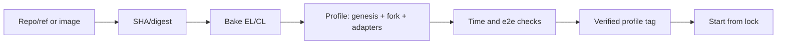

# Multiple EL/CL versions and Gloas in zap-net

Research dated September 29, 2026; zap-net `9078f84`. Local code and public sources at specific SHAs
were inspected. No new clients were built, and no Gloas network was started. The version snapshot
and patch-check result are saved in the [report](../reports/client-version-research.json).

**Recommendation:** add a catalog of separate EL/CL builds and named profiles of compatible bundles.
A profile pins the EL, BN/VC, genesis-generator, protocol schedule, adapters, and verification
results. The user builds a bundle once and starts it by tag. Time advancement remains a mandatory
readiness criterion for every controlled profile.

Initial scope: different versions, branches, and custom commits of **Geth + Lighthouse**. Other
client families can use the same catalog, but each needs its own startup and payload-readiness
adapter, plus controlled clocks for the CL. Supporting an arbitrary image does not mean it already
supports time advancement.

**Current pins.** The current checkout uses Geth v1.15.11, Lighthouse v7.1.0 with our patch, and
genesis-generator v4.0.0. This is the verified Pectra profile. Upstream `master` and `unstable`
branches are not automatically fetched.

| Location                                                       | Current coupling                                     | Required change                                          |
| -------------------------------------------------------------- | ---------------------------------------------------- | -------------------------------------------------------- |
| [config.ts](../src/config.ts)                                  | One global image table                               | Profile selection with immutable references              |
| [prepare_clients.ts](../scripts/prepare_clients.ts)            | One Lighthouse SHA, checkout, and patch              | Recipe, ref → SHA resolution, patchset catalog           |
| [build.ts](../scripts/build.ts)                                | One output, tag, container name, and target cache    | Build by key, separate outputs and locks                 |
| [network.ts](../src/network.ts)                                | Shared images, Electra from genesis, fixed arguments | Startup from a resolved profile; client/genesis adapters |
| [engine.ts](../src/engine.ts)                                  | Payload readiness from Geth 1.15.11 JSON logs        | Versioned strategy and Engine capability checks          |
| [time.ts](../src/time.ts), [consensus.ts](../src/consensus.ts) | One phase grid; payload inside BeaconBlock           | Fork-aware phases, barriers, and execution-state reads   |
| [e2e](../bakes/shared/tests/e2e.ts) and validator tests        | Pectra APIs/structures and rules                     | Shared scenarios plus assertions for the selected fork   |

**What Gloas means for this project.** Gloas is the consensus part of Glamsterdam; its EL
counterpart is Amsterdam. In the inspected genesis-generator, `GLOAS_FORK_EPOCH` is converted to
`amsterdamTime`. A Docker tag name alone defines neither the fork nor its activation time.
[Generator code](https://github.com/ethpandaops/ethereum-genesis-generator/blob/51fb77af3ad017ab2ae14a6e69246fe95453cdd2/apps/el-gen/generate_genesis.sh#L759).

The inspected Gloas introduces a separate payload envelope and payload timeliness committee (PTC).
With 12 s slots, attestation/sync-message deadlines are at 3 s, aggregates/contributions and payload
at 6 s, and payload attestations at 9 s. These are protocol deadlines; actual sending may happen
earlier. Our current 0/4/6/8/9/11.5 s grid and the expectation of full EL/CL agreement as soon as a
Beacon block appears require separate revision.
[Validator specification at a pinned SHA](https://github.com/ethereum/consensus-specs/blob/e321975f8295d6872adfeb5d35db5202676739a0/specs/gloas/validator.md).

Self-build is part of the protocol and implemented in current Lighthouse. It therefore makes sense
to start with one EL, BN, and VC, without an external builder/relay. Ordinary signature checks
remain; the standard client handles the special self-build bid representation under the fork rules.
[Lighthouse block service](https://github.com/sigp/lighthouse/blob/2d281dfa1b407f7c81cd123954a9fd18ee8f02d2/validator_client/validator_services/src/block_service.rs),
[Gloas block production](https://github.com/sigp/lighthouse/blob/2d281dfa1b407f7c81cd123954a9fd18ee8f02d2/beacon_node/beacon_chain/src/block_production/gloas.rs).

The topology remains compact, but operation with our mainnet preset, 64 validators, and controlled
clocks still needs verification. Lighthouse itself has a Gloas genesis-sync fixture with Geth, but
it uses the minimal preset, 6 s slots, and multiple nodes; this is a useful starting point, not a
zap-net verification result.
[Upstream fixture](https://github.com/sigp/lighthouse/blob/2d281dfa1b407f7c81cd123954a9fd18ee8f02d2/scripts/tests/genesis-sync-config-gloas.yaml).

**Inspected upstream snapshots.** These SHAs are initial porting candidates, not a certified
compatible combination.

| Component         | Ref during research | Commit                                     |
| ----------------- | ------------------- | ------------------------------------------ |
| Lighthouse        | `unstable`          | `2d281dfa1b407f7c81cd123954a9fd18ee8f02d2` |
| Geth              | `master`            | `f8f9bc574459a1afefac7b63163739910ee0fe62` |
| Genesis generator | `master`            | `51fb77af3ad017ab2ae14a6e69246fe95453cdd2` |
| Consensus specs   | `master`            | `e321975f8295d6872adfeb5d35db5202676739a0` |
| Execution APIs    | `main`              | `5bcdc34a477b10af278c079525374e6a4046f291` |

A coordinated devnet revision is preferable for the first reproducible bundle. For example,
ethPandaOps publishes paired Geth/Lighthouse tags and specification versions for
glamsterdam-devnet-7. This illustrates bundle organization; those Docker tags must also be resolved
to digests, and the Lighthouse source SHA obtained for applying the clock patch. An ordinary
upstream CL image can serve as a baseline, but adding environment variables does not give it our
clock. [Devnet specification](https://notes.ethereum.org/@ethpandaops/glamsterdam-devnet-7).

**Confirmed obstacles to simply replacing images.**

1. `git apply --check` of the current `clients/lighthouse.patch` against Lighthouse `2d281dfa…`
   failed: the patch does not apply to 7 of 13 files, including Cargo.lock, slot_clock,
   state_advance_timer, and validator services. This checked applicability only, without modifying
   downloaded files. A separate maintained patchset is needed.
2. The new `payload_attestation_service.rs` and `proposer_preferences_service.rs` use
   `tokio::time::sleep`. They are absent from the current clock patch. New waits must be classified,
   protocol timers converted, and completion marks added. Network deadlines and JWT continue to use
   real clocks.
   [Payload attestations](https://github.com/sigp/lighthouse/blob/2d281dfa1b407f7c81cd123954a9fd18ee8f02d2/validator_client/validator_services/src/payload_attestation_service.rs),
   [proposer preferences](https://github.com/sigp/lighthouse/blob/2d281dfa1b407f7c81cd123954a9fd18ee8f02d2/validator_client/validator_services/src/proposer_preferences_service.rs).
3. Amsterdam adds `engine_forkchoiceUpdatedV4`, `engine_getPayloadV6`, `engine_newPayloadV5`,
   additional fields, and custody columns. The proxy must forward them without loss, and the
   readiness strategy must be verified on the selected version. A method's presence in
   `engine_exchangeCapabilities` alone does not prove correctness of the full stack.
   [Engine API at a pinned SHA](https://github.com/ethereum/execution-apis/blob/5bcdc34a477b10af278c079525374e6a4046f291/src/engine/amsterdam.md),
   [Geth implementation](https://github.com/ethereum/go-ethereum/blob/f8f9bc574459a1afefac7b63163739910ee0fe62/eth/catalyst/api.go).
4. Geth's `Updated payload` event still exists: it is logged after setting the full payload under a
   lock. This supports trying to retain the current approach without forking Geth. Its suitability
   still needs checking with empty blocks, transactions, new payload versions, and a long real
   pause.
   [Payload builder](https://github.com/ethereum/go-ethereum/blob/f8f9bc574459a1afefac7b63163739910ee0fe62/miner/payload_building.go#L118).
5. Genesis is an independent dependency. The current generator includes Gloas/Heze and new
   parameters, and Fulu is enabled from genesis by default. Updating the generator without an
   explicit schedule can change even the old Pectra profile. All fork epochs, versions, and system
   contracts must be pinned, including disabled subsequent forks.
   [Defaults](https://github.com/ethpandaops/ethereum-genesis-generator/blob/51fb77af3ad017ab2ae14a6e69246fe95453cdd2/defaults/defaults.env),
   [generator dependencies](https://github.com/ethpandaops/ethereum-genesis-generator/blob/51fb77af3ad017ab2ae14a6e69246fe95453cdd2/Dockerfile).

**Three catalog entities.**

| Entity         | Contents                                                                   | Example name             |
| -------------- | -------------------------------------------------------------------------- | ------------------------ |
| Recipe         | Repo + ref or a prebuilt image; toolchain, flags, platform, patchset       | `lighthouse-gloas-clock` |
| Build artifact | Resolved SHA, build key, image ID/digest, clock API version                | `lh-gloas-20260929`      |
| Profile        | Specific EL + CL + generator, fork schedule, adapters, verification record | `gloas-lab-1`            |

Component tags allow changing only Geth or only Lighthouse in an experiment. A profile tag preserves
the entire verified bundle for ordinary e2e. BN and VC use the same Lighthouse build by default;
arbitrary mixing of their versions is outside the first phase.

A Git branch is resolved once at bake time to a full commit SHA. A Docker tag is resolved to a
digest for the selected platform. For a locally built image, store the Docker image ID: a registry
digest may not exist before publication. These identifiers must not be conflated. Startup uses the
pinned identity, so later movement of a tag does not change an existing test network.

Proposed storage: JSON recipes and `profiles/<tag>.lock.json` under Git; sources and intermediate
outputs in ignored `.cache/`. No new YAML dependency or separate database is needed. The lock also
contains platform, recipe/patch hashes, source URLs, dependency locks, genesis adapter, protocol
adapter, clock ABI, and verification-result links. Network-specific secrets do not belong there.



**Proposed interface.** The following commands and `profile` field are not yet implemented; this is
an API sketch.

```sh
# Build components from a recipe and create a candidate profile.
deno task bake --recipe recipes/gloas.json --tag gloas-lab-1

# All checks use already resolved SHAs/image identities.
deno task profiles:verify gloas-lab-1
deno task up --profile gloas-lab-1

# Select the old network explicitly, preserving its previous behavior.
deno task up --profile pectra-stable
```

```ts
await using net = await Devnet.start({ id: "staking-e2e", profile: "gloas-lab-1" });
await net.advanceTime(3600);
```

`bake` is separate from `up`: starting a completed profile does not compile clients or update refs.
A missing image produces a clear error or is downloaded by pinned digest if published. Browsing
builds also needs `clients:list/inspect`, `profiles:list/inspect`, and creation of a candidate from
existing component tags. Overwriting a profile name is a separate explicit operation; a failed build
does not change the previous working tag.

Verification states should be stored separately: `built`, `smoke-tested`, `e2e-tested`. Verified
compatibility applies to the EL/CL/generator/adapters/schedule/platform tuple and test-suite
version. A new pairing of clients already verified individually creates a new unverified tuple. It
is available for experiments and `profiles:verify`, but does not automatically become verified.

**Build organization.**

- Compute the build key from repo URL, SHA and submodules, patchset hash, recipe revision,
  builder/runtime image digests, dependency locks, build flags, and target platform. Build
  timestamps must not change the key. For a dirty checkout, record a separate snapshot/diff hash or
  require a commit; modified source cannot be identified by a clean SHA alone.
- Store sources in separate directories by SHA, outputs by build key. Do not reuse the current
  shared `.cache/upstream/lighthouse` and `.cache/image` as mutable locations for all versions.
  Check patch application before compiling, without automatic conflict resolution.
- The Cargo registry can be reused with proper locking. Separate compiled target caches by
  toolchain/target/recipe; do not run independent builds concurrently in one target directory.
  Similarly, separate the Go module/download cache from build outputs.
- Build-container names, labels, and locks must account for build key/job. The current shared ID
  `build` would collide. Preserve exact `io.zap-net.id` ownership; cleanup must not affect other
  builds.
- Build native `linux/arm64` on this machine first. `linux/amd64` is a separate artifact requiring
  separate verification; a successful arm64 build does not establish that it works.
- Pin the toolchain for each recipe. The inspected upstream Lighthouse Dockerfile uses Rust 1.88.0;
  Geth go.mod requires Go 1.25.0. Do not use one builder for arbitrary future refs without checking.
  Pinning images/dependencies gives a repeatable set of inputs, but does not prove bit-for-bit
  reproducibility with unpinned apt repositories.
  [Lighthouse Dockerfile](https://github.com/sigp/lighthouse/blob/2d281dfa1b407f7c81cd123954a9fd18ee8f02d2/Dockerfile),
  [Geth go.mod](https://github.com/ethereum/go-ethereum/blob/f8f9bc574459a1afefac7b63163739910ee0fe62/go.mod).

**Preserving time advancement.** Separate client and protocol adapters. The client adapter knows CLI
arguments, ports, genesis init, and payload-readiness specifics. The protocol adapter knows the
active fork, Beacon API formats, CL/EL relationship rules, and required duties. The clock adapter
reports our API version, source/patch identity, and supported marks. A uniform JSON-RPC URL remains
part of zap-net's public API.

`Timeline` needs a phase plan for each slot, derived from the fork schedule. At a Fulu → Gloas
transition, the next slot selects the new plan. Mainnet preset, 12 s, and 32 slots remain explicit
profile parameters. The 3/6/9 s deadlines are calculated from the pinned specification's parameters;
additional internal client barriers come from the clock adapter. The implementation cannot be
reduced to replacing 4 seconds with 3: envelope readiness, PTC, state advance, and fork choice are
separate events.

In Gloas, normalized execution state must account for the Beacon root, bid, envelope availability,
and FULL/EMPTY payload status. Checking `body.execution_payload.block_hash` is no longer suitable.
EL/CL agreement and finalized execution hash are checked after the required state transitions; a
Beacon block's appearance alone does not mean the payload was imported. Separate barriers are needed
for proposals, envelope, ordinary votes/aggregates, and PTC, bound to slot and block root.
[Gloas fork choice](https://github.com/ethereum/consensus-specs/blob/e321975f8295d6872adfeb5d35db5202676739a0/specs/gloas/fork-choice.md).

`advanceTime`/`advanceTo` still execute intermediate duties; `skipSlots` explicitly skips them. For
skips, additionally check PTC/preferences recovery after VC restart and valid payload absence in
skipped slots. Real RPC/JWT timeouts do not advance with protocol time. Startup checks the clock ABI
in both processes and refuses controlled mode if the image does not provide it. A compatible ABI is
necessary, but correct time behavior is established by e2e.

Pin the entire genesis schedule: previous forks, target fork, and disabled subsequent forks. With a
fixed 12-second slot, `EL activation time = genesis time + epoch × 32 × 12`. Prefer representing
disabled epochs as `disabled` and converting them to each client's representation; max uint64 cannot
be safely stored as an ordinary JavaScript number. The generator and init must use the same selected
EL/CL bundle. Client changes cannot silently apply to an existing database: e2e defaults to a new
test network with a separate ID and empty owned volumes.

**Implementation order and readiness criteria.**

1. Extract the existing bundle into `pectra-stable`, introduce recipes/locks and profile selection,
   preserving current client binaries and protocol parameters. Reuse dockerode. Criterion: the
   existing 14 tests pass, and two bundles can coexist independently in the catalog.
2. Implement bake/import for Geth and Lighthouse, patchsets, isolated outputs, and provenance.
   Criterion: a second bake of the same key reuses the existing artifact; a different
   SHA/patch/platform does not overwrite the first; a failed build leaves the working profile
   available.
3. Pin a Gloas cohort and first run an **ordinary baseline** with real current time: genesis,
   self-build, transaction, actual finality. This separates upstream-client incompatibility from
   clock-patch errors. Check the new generator's resulting EL/CL configs.
4. Port the clock patch, introduce the Gloas protocol adapter and new marks. First check Gloas from
   genesis, then a separate Fulu → Gloas profile. Criterion: pause, duration/date, several epochs,
   full payload, PTC, and finalized EL hash; never infer finality from slot count.
5. Run the full suite: deposit → activation, consolidation, signed exit → real payments, automine
   with nonce gaps/fees, sequential deployment, long skip, and cleanup. Check Gloas's new churn
   parameters separately: do not treat the previous `churnLimitQuotient: 4` override as universal.
   The profile then receives `e2e-tested` status and a stable user-facing tag.

The catalog and tag selection are relatively isolated work. Gloas's main uncertainty lies in porting
schedulers and barriers, aligning genesis/Engine revisions, and handling payload status. There is no
basis yet to promise Gloas operation after changing a single tag. The first useful result is a
catalog with preserved Pectra and a Gloas candidate; the first ready Gloas profile is only a bundle
with working time advancement and passing real tests.

**Work completed in this research.** Read current build/lifecycle/time/Engine paths; obtained five
exact upstream SHAs; downloaded selected sources; ran a patch-application check with a negative
result. Confirmed self-build in Lighthouse, new services with real timers, Amsterdam methods in
Geth, and the generator's Gloas epoch → Amsterdam timestamp mapping. No new Docker builds, client
runs, measurements, or Gloas e2e tests were performed. The existing
[external-network forking research](forking-research.md) concerns a different capability and is
preserved separately.
