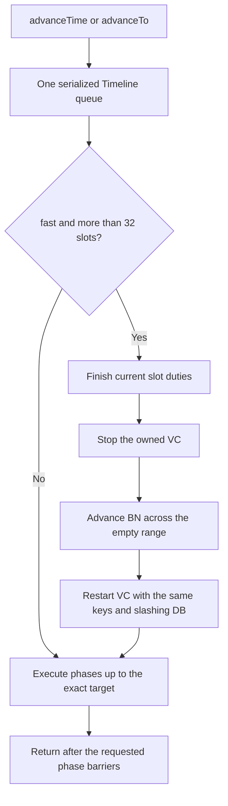

# How protocol time and warp work

This describes the current implementation, checked against the source on 2026-10-01. Start here for
the algorithm; use [the API guide](usage.md) to run it and [mode validation](warp-modes.md) for
measured results. Earlier optimization proposals are indexed in
[the experiment log](warp-experiments.md).

## The idea in one minute

Panda controls one Geth execution client (EL), one Lighthouse beacon node (BN), and one Lighthouse
validator client (VC) holding the network's validator keys. The BN and VC have explicit protocol
clocks. The controller moves those clocks and waits for the resulting work. A 12-second protocol
slot therefore takes as long as the real computation and I/O require, without waiting 12 host
seconds.

There are two ways to cover a long interval:

| Mode                      | Work between the start and destination                                              | Consequence                                                                |
| ------------------------- | ----------------------------------------------------------------------------------- | -------------------------------------------------------------------------- |
| `honest`, the default     | Execute each slot's proposal, votes and state transitions                           | Continuous participation; runtime grows with the number of slots           |
| `fast`, explicit per call | Finish current duties, pass through empty slots, then produce the destination block | Faster, with real missed-duty penalties, lost rewards and delayed finality |

Both use the same selected bake. Fast still processes real empty-slot and epoch transitions; it does
not assign a fabricated future state. Neither mode disables slashing protection. Slashing is a
failure, not an allowed side effect of fast mode.



## Clock and API semantics

Time in the public API is Unix **seconds**, with millisecond precision; `advanceTo` also accepts a
JavaScript `Date`. Internally it is integer milliseconds. With genesis time `G` in milliseconds:

```text
slot(t) = floor((t - G) / 12000)
epoch(t) = floor(slot(t) / 32)
```

`advanceTime(delta)` computes its target from the current time when its queued operation starts.
`advanceTo(target)` uses the supplied absolute target. Concurrent relative calls add their
durations; an absolute target can become stale while queued and then be rejected. Backward time
travel is rejected. Reading status does not advance time.

| API                                      | Destination and behavior                                                               |
| ---------------------------------------- | -------------------------------------------------------------------------------------- |
| `advanceTime(seconds, { mode })`         | Exact current time plus duration; mode defaults to `honest`                            |
| `advanceTo(unixSecondsOrDate, { mode })` | Exact supplied time; mode defaults to `honest`                                         |
| `stepSlot()` / `advanceSlots(n)`         | Honest advancement to offset 11.5 seconds of the destination slot; `n = 0` is a no-op  |
| `advanceEpochs(n)`                       | `advanceSlots(n * 32)`; it does not round to an epoch boundary                         |
| `skipSlots(n)`                           | Finish current duties and skip `n` slots; no destination block is produced             |
| `advanceUntil(predicate, options)`       | Check the predicate, then request honest slots until satisfied or the limit is reached |

An exact target halfway through a slot completes only phases up to that time. Later duties await
another advancement. A block timestamp is the **slot start**, so it need not equal the controller's
exact `status().now`. Use `stepSlot` when a test needs a complete slot instead of an exact date.

Protocol clocks are process-local; the host clock is untouched. The Lighthouse patch wakes selected
protocol tasks through a Tokio watch channel. Socket deadlines, JWT timestamps, watchdogs and
measurements use real time. Setting a clock wakes work but does not by itself prove that work
finished.

## Honest mode: execute and acknowledge each phase

[`Timeline.to`](../src/time.ts) repeatedly chooses the next configured phase or the exact target,
whichever comes first. It awaits `Consensus.move(at, phase)` before recording the new time and
continuing. There is no fixed real-time sleep between slots.

For each move, [`Consensus`](../src/consensus.ts) first updates EngineGate's protocol time, then the
BN clock, then the VC clock. At a slot boundary it waits for the BN's `slot` mark before advancing
the VC, so the proposer cannot run ahead of the beacon node.

| Work / completion barrier                                                        | Pectra offset | Gloas offset |
| -------------------------------------------------------------------------------- | ------------- | ------------ |
| Proposal: BN slot mark, real Beacon head at this slot, EL/CL execution agreement | 0 s           | 0 s          |
| Attestations and sync messages; direct-sync BN coverage barrier when supported   | 4 s           | 3 s          |
| Additional schedule wake-up; no separate controller completion barrier           | 6 s           | —            |
| Attestation aggregates; sync aggregate publication when direct-sync is absent    | 8 s           | 6 s          |
| BN state preparation; additionally VC payload attestations (PTC) on Gloas        | 9 s           | 9 s          |
| BN fork-choice preparation                                                       | 11.5 s        | 11.5 s       |

Phase offsets come from the recipe embedded in the selected immutable bake. Completion marks name
both the work and its slot: an acknowledgement for another slot cannot satisfy the barrier.
Attestation/aggregate waits use the actual nonempty committees for that slot. Gloas has its own
attestation mark and an additional PTC barrier because its execution payload arrives separately.

With `clockWait`, the controller uses the native `/wait/<slot>/30000/<marks>` endpoint; older bakes
poll marks. Ordinary barriers have bounded real waits. Proposal processing at phase 0 verifies the
Beacon head's execution payload against Geth's latest block hash and timestamp. For Gloas this also
requires the envelope's slot and hash to match the block's bid. A Beacon block alone is not enough
to prove execution has caught up.

The returned head can have complete duties without itself being finalized: finality follows the
normal multi-epoch process. An honest call ending before a duty phase does not claim that later
phase ran.

## What `direct-sync` changes

`honest` selects the scheduling algorithm. `directSync` is an optional native capability of a bake.
They are separate concepts. The measured Gloas `direct-sync` artifact has it; the older measured
Pectra `panda` artifact does not. Editing today's recipe does not update an existing tag.

In a bake with `directSync`, the VC still signs and publishes individual sync committee messages.
The BN performs ordinary message validation and collects verified messages in its normal aggregation
pool. Once all four subcommittees have all 128 positions, it inserts their contributions directly
into the normal block operation pool. Controlled mode omits the sync aggregator election and its
publication wrappers. The later block still carries a real aggregate signature and participation
bits.

The BN then writes `sync_contributions_<beaconRoot> = slot`. The controller requires this mark and
checks that the root is the same one whose execution was confirmed at phase 0. A VC publication mark
alone is insufficient: it can follow an HTTP publication error. Pool admission alone is also
insufficient, particularly while a Gloas envelope is pending. Missing coverage or a changed head
causes a bounded failure instead of successful advancement with incomplete sync participation.

The retained client also includes a bounded cache of successful, byte-identical BLS verification
inputs and randomized batch preverification. Membership and state checks still run; failed batches
fall through to individual checks. These earlier changes belong to the selected bake. Group signing,
shared-hash signing and same-message MSM research prototypes are not integrated.

Implementation: [direct-sync patch generator](../bakes/shared/patch_direct_sync.py),
[verification cache](../bakes/shared/native/verified_signature.rs),
[batch preparation](../bakes/shared/native/sync_batch.rs). The generated fork-specific
`lighthouse.patch` is the actual build input; the Python scripts maintain it.

## Fast mode: skip the gap, then execute the destination

The condition is a **slot-index difference greater than 32**, not a duration rounded to an epoch.
For 32 or fewer crossed slots the ordinary phase executor runs even with `{ mode: "fast" }`. For a
larger jump to slot `T`, [`Timeline.warpTo`](../src/time.ts) does this:

1. Finish the current slot through offset 11.5 seconds, unless time is already later in that slot.
2. Compute `beforeDestination = G + (T - 1) * 12000 + 11500`.
3. Call `Consensus.skip(beforeDestination)`, which invokes `Network.skipValidator`.
4. Run the ordinary phase executor from that point to the exact requested target. Crossing offset 0
   of slot `T` produces its real block and waits for EL/CL agreement. Remaining destination duties
   run only as far as the requested target.

[`Network.skipValidator`](../src/network.ts) finds the single VC with the exact network ownership
label and stops it. The BN clock moves across the gap while the VC cannot sign. If the bake supports
`preparedSkip`, the controller waits for `skip_ready` before starting a replacement VC. It reuses
the image, keys, data mounts and slashing database, sets the new starting protocol time and waits
for startup and validator indices. Private VC ports are reallocated and the manifest is updated.

The Gloas [prepared-skip helper](../bakes/gloas/native/prepare_skip.rs) calls real per-slot
processing up to the destination pre-state, stores intermediate states through the ordinary store,
and keeps the existing block head. State caching and batched persistence reduce repeated work. Older
bakes perform catch-up when subsequent duties/block processing request it; their recovery waits are
longer. The fast path therefore still costs state transitions and one VC restart, not constant-time
arithmetic.

For example, starting at slot 128 + 11.5 s and advancing `8192 * 12` seconds:

| Mode   | Intermediate slots                                       | Return point       |
| ------ | -------------------------------------------------------- | ------------------ |
| Honest | Produce slots 129 through 8320 and run their phases      | Slot 8320 + 11.5 s |
| Fast   | Empty slots 129 through 8319; produce slot 8320 normally | Slot 8320 + 11.5 s |

Empty slots do not contain EL transactions, validator votes or fabricated finalized checkpoints.
Consensus rewards/penalties and queues evolve under the real rules. Balances can decrease; very
large or repeated gaps can affect validator eligibility. The tested two ×8192 range is not a promise
that arbitrary downtime preserves an active validator set. Use honest mode for economic or
validator-lifecycle scenarios that require continuous participation.

After fast returns, transactions can be executed in subsequent slots while finality remains behind.
Finality recovers only when further honest slots and votes are processed. With automine off, no
background real-time wait will advance it; use `advanceUntil` or explicit slot advancement.

## Geth, automine and the next transaction

Geth receives block timestamps through the Engine API. Panda does not change Geth's host clock or
patch its timestamp handling. [`EngineGate`](../src/engine.ts), in the controller process, delays
speculative payload preparation for future protocol time. For the current payload it waits for the
pinned Geth JSON `Updated payload` event before forwarding `getPayload`. This prevents returning the
initial empty payload while the transaction-bearing payload is still being built. Payload contents
and execution validation remain Geth's responsibility.

[`Automine`](../src/automine.ts) examines executable pending transactions, then requests an honest
`stepSlot` through the same Timeline queue. It does not add a 12-second wall-clock pause. Sequential
dependent deployments can therefore submit the next transaction after the previous receipt and
trigger another slot. Use the public controller RPC; calls directly to private Geth do not notify
automine. Nonce gaps or an unchanged candidate set do not cause endless empty block production.

For a deterministic manual warp, `await net.setAutomine(false)` first. If it remains enabled,
automine can enqueue subsequent slots after the warp; exact target semantics apply to the warp
operation, not indefinitely to later status reads.

## Failures and time budgets

Invalid arguments, backward targets and unsupported fast backends are rejected before mutation. If a
phase or skip fails after work has begun, Timeline faults: future advancement requests fail with
`reset required`. The operation is not transactional and does not roll back clocks, blocks or
signatures. Reset creates a fresh network; there is no supported resume of partial controller state.
An HTTP client timing out is not a cancellation or rollback of server-side work.

The **25-second fast budget** is an assertion in the 8192-slot regression test, including the first
subsequent transaction. It is not a universal API timeout. Runtime operations have their own bounded
waits, and public control calls currently allow up to one real hour. Honest long tests have separate
watchdogs; none of these deadlines change protocol slot length.

## Verification and where to change things

Current real evidence includes two fast 8192-slot jumps on each measured profile, resumed finality,
EL/CL agreement and signing history. Short honest runs verify rewards, participation and subsequent
deployment. Full honest two ×8192 and the complete lifecycle/failure matrix remain unverified. See
[results and exact bake keys](warp-modes.md) and [acceptance criteria](warp-tdd-acceptance.md). The
historical approximately 13-minute Gloas estimate is not a new successful full-run benchmark.

| Change or question                                       | Start here                                                                                                                   |
| -------------------------------------------------------- | ---------------------------------------------------------------------------------------------------------------------------- |
| Public options and HTTP dispatch                         | [api.ts](../src/api.ts), [controller.ts](../src/controller.ts)                                                               |
| Target calculation, phase loop, serialization and faults | [time.ts](../src/time.ts)                                                                                                    |
| Phase barriers and EL/CL comparison                      | [consensus.ts](../src/consensus.ts)                                                                                          |
| VC stop/replacement, mounts and ownership                | [network.ts](../src/network.ts), [docker.ts](../src/docker.ts)                                                               |
| Native protocol clock and completion marks               | [controlled_clock.rs](../bakes/shared/controlled_clock.rs)                                                                   |
| Fork capabilities and immutable artifacts                | [bake layout](../bakes/README.md), [bake commands](bakes.md)                                                                 |
| Mode selection, exact targets and fault regressions      | [time_test.ts](../tests/time_test.ts), [warp_api_test.ts](../tests/warp_api_test.ts)                                         |
| Two long jumps, first tx, finality and signing history   | [warp.ts](../bakes/shared/tests/warp.ts), [warp_fast.ts](../bakes/shared/tests/warp_fast.ts)                                 |
| Economic assertions and full duty coverage               | [warp_economics.ts](../bakes/shared/tests/warp_economics.ts), [warp_assertions.ts](../bakes/shared/tests/warp_assertions.ts) |
| Rewards before historical state pruning                  | [warp_rewards.ts](../bakes/shared/tests/warp_rewards.ts), [regression](../tests/warp_rewards_test.ts)                        |

The design assumes one controlled BN and a VC holding the required local keys. Multi-node consensus,
external signers, arbitrary validator sets and fork transitions need their own design and acceptance
checks. Keep profile builds/tests independent; new shared behavior needs TDD and validation on each
profile being released. Measured component optimizations in `reports/warp-tdd` are historical
evidence, not additional runtime algorithms.
